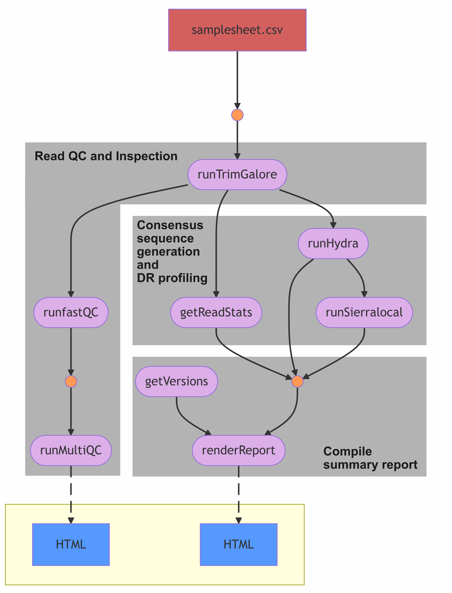

# HUGTiP HIV-1 Drug Resistance and Lineage Profiling

Active development since 2025-01-20! Use with caution.

## Introduction

This Nextflow Pipeline was build similarly to [QuasiFlow](https://github.com/AlfredUg/QuasiFlow), and utilises [Quasitools HYDRA](https://phac-nml.github.io/quasitools/) for the mapping, variant calling and generation of consensus HIV-1 polymerase. Futher classification of drug resistance profiles and scores is done using the [Sierra-local](https://github.com/hivdb/sierra-client/blob/master/python/README.md) through the python package [SierraPy](https://github.com/hivdb/sierra-client/blob/master/python/README.md). Please cite the relevant tools if utilising this workflow.



## Installation

This pipeline was built and tested using Nextflow v24.10.1.5930, it has been largely tested using conda as the package manager, but is supported with Docker and Singularity container images built using [Seqera container webtool](https://seqera.io/containers/).

The first option is to install the pipeline using nextflow, it will be installed in the $HOME directory under the .nextflow sub-directory. Confirm that installation was successful by printing out the help message.

```{sh}
nextflow pull phesketh-igtp/HUGTiP-HIV-1.nf
nextflow run ~/.nextflow/assets/phesketh-igtp/HUGTiP-HIV-1.nf --help
```

Alternatively, the github repository can be cloned.

```{sh}
git clone phesketh-igtp/HUGTiP-HIV-1.nf
nextflow run ./phesketh-igtp/HUGTiP-HIV-1.nf/main.nf --help
```

With the repository available locally, you can proceed with performing the test to ensure that everything works on your system. You may need to adjust the paths in the samplesheet to perform the test.
```{sh}
nextflow run ./phesketh-igtp/HUGTiP-HIV-1.nf/main.nf \
            --samplesheet test/samplesheet.csv \
            --runID test \
            --outdir init-test \
            -profile conda_on #OR: docker_on, singularity_on, aptainer_on
```

You can compare the outputs from the test with the expected results in the rest directory (e.g. <code>test/*.results.html</code>).

----

## Usage

To run the pipeline you require a csv file that contains 4 columns, consult the </code>example test/samplesheet.csv</code>: 
1. sampleID - name of the sample
2. forward - full path to forward reads
3. reverse - full path to reverse reads
4. type - either 'sample' or 'control'

| sampleID | forward | reverse | type |
| -------- | -------- | -------- | -------- |
| sample-1 | ../test/sample1_R1.fastq.gz | ../test/sample1_R2.fastq.gz | sample |
| sample-8 | ../test/sample8_R1.fastq.gz | ../test/sample8_R2.fastq.gz | control |

### Simple usage

```{sh}
nextflow run ./phesketh-igtp/HUGTiP-HIV-1.nf/main.nf \
            --samplesheet /path/to/samplesheet.csv \
            --outdir /path/to/output \
            -p conda_on
```

### Parameters

#### HyDRA parameters

**Mandatory parameters**

- <code>--samplesheet</code> : Path to samplesheet csv (',' seperated)

**Optional parameters**
- <code>--reporting_threshold</code> : Minimum mutation frequency percent to report.
- <code>--consensus_pct</code> : Minimum percentage a base needs to be incorporated into the consensus sequence.
- <code>--min_read_qual</code> : Minimum quality for a position in a read to be masked.
- <code>--length_cutoff</code> : Reads which fall short of the specified length will be filtered out.
- <code>--score_cutoff</code> : Reads that have a median or mean quality score (depending on the score type specified) less than the score cutoff value will be filtered out.
- <code>--min_variant_qual</code> : Minimum quality for variant to be considered later on in the pipeline.
- <code>--min_dp</code> : Minimum required read depth for variant to be considered later on in the pipeline.
- <code>--min_ac</code> : The minimum required allele count for variant to be considered later on in the pipeline
- <code>--min_freq</code> : The minimum required frequency for mutation to be considered in drug resistance report.

#### Output parameters

**Optional parameters**

- <code>--outdir</code> : Path to directory where results will be saved (default: ./out)
- <code>--workDir</code> : Path to directory where temporary work directory will be saved - can be deleted after analysis (default: ./work)


----

## Outputs

```{sh}
.
├── fastQC
│   ├── ${sampleID}_val_{1,2}_fastqc.html
│   └── ${sampleID}_val_{1,2}_fastqc.zip
├── final-report
│   └── ${sampleID}.report.html
├── hydra
│   ├── ${sampleID}.consensus.fasta
│   ├── ${sampleID}.dr_report.csv
│   ├── ${sampleID}.hydra.coverage.tsv
│   └── ${sampleID}.hydra.vcf
├── multiQC
│   └── raw_reads_multiqc_report.html
├── readStats
│   ├── ${sampleID}-1.length-freq.tsv
│   └── ${sampleID}-1.stats.tsv
└── sierra
    └── ${sampleID}.sierrapy.hiv1.csv
```

## Citations

- Ewels P. et al.  (2016) [MultiQC: summarize analysis results for multiple tools and samples in a single report.](https://doi.org/10.1093/bioinformatics/btw354) Bioinformatics, 32, 3047–3048.
- Ho J.C. et al.  (2019) [Sierra-local: a lightweight standalone application for drug resistance prediction.](https://joss.theoj.org/papers/10.21105/joss.01186.pdf) Softw. J. Open Source Softw., 4, 1186.
- Krueger F. (2012) [Trim Galore: A Wrapper Tool Around Cutadapt and FastQC to Consistently Apply Quality and Adapter Trimming to FastQ files, with Some Extra Functionality for MspI-Digested RRBS-Type (Reduced Representation Bisufite-Seq) Libraries.](http://www.bioinformatics.babraham.ac.uk/projects/trim\_galore/)
- Langmead B., Salzberg S.L. (2012) [Fast gapped-read alignment with Bowtie 2.](https://www.nature.com/articles/nmeth.1923) Nat. Methods, 9, 357–359.
