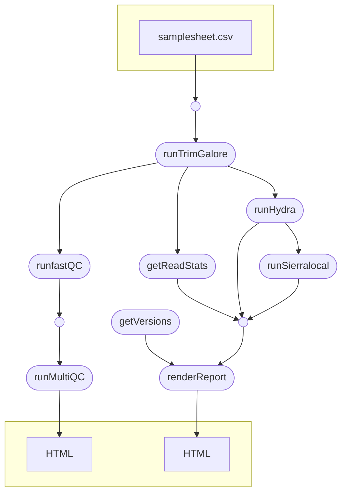

```mermaid
flowchart TB
    subgraph " "
    v0["samplesheet.csv"]
    end
    subgraph " "
    v17["HTML"]
    v34["HTML"]
    end
    v6([getVersions])
    v8([runTrimGalore])
    v10([runfastQC])
    v14([getReadStats])
    v16([runMultiQC])
    v19([runHydra])
    v21([runSierralocal])
    v33([renderReport])
    v1(( ))
    v11(( ))
    v22(( ))
    v0 --> v1
    v6 --> v33
    v1 --> v8
    v8 --> v10
    v8 --> v14
    v8 --> v19
    v10 --> v11
    v14 --> v22
    v11 --> v16
    v16 --> v17
    v19 --> v21
    v19 --> v22
    v21 --> v22
    v22 --> v33
    v33 --> v34
```