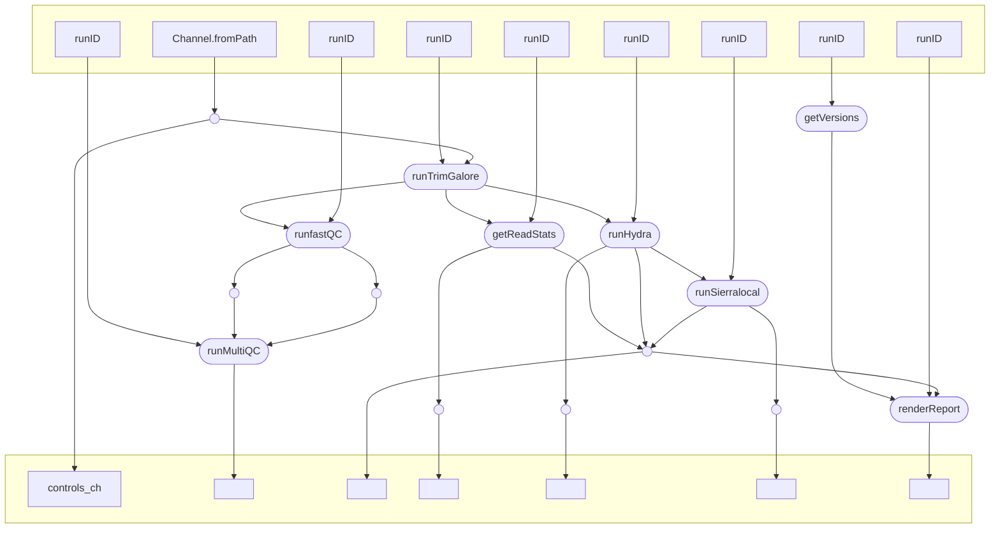

```mermaid
flowchart TB
    subgraph " "
    v0["Channel.fromPath"]
    v5["runID"]
    v7["runID"]
    v9["runID"]
    v13["runID"]
    v15["runID"]
    v18["runID"]
    v20["runID"]
    v32["runID"]
    end
    subgraph " "
    v4["controls_ch"]
    v17[" "]
    v25[" "]
    v27[" "]
    v29[" "]
    v31[" "]
    v34[" "]
    end
    v6([getVersions])
    v8([runTrimGalore])
    v10([runfastQC])
    v14([getReadStats])
    v16([runMultiQC])
    v19([runHydra])
    v21([runSierralocal])
    v33([renderReport])
    v1(( ))
    v11(( ))
    v12(( ))
    v22(( ))
    v26(( ))
    v28(( ))
    v30(( ))
    v0 --> v1
    v1 --> v4
    v5 --> v6
    v6 --> v33
    v7 --> v8
    v1 --> v8
    v8 --> v10
    v8 --> v14
    v8 --> v19
    v9 --> v10
    v10 --> v11
    v10 --> v12
    v13 --> v14
    v14 --> v22
    v14 --> v26
    v15 --> v16
    v11 --> v16
    v12 --> v16
    v16 --> v17
    v18 --> v19
    v19 --> v21
    v19 --> v22
    v19 --> v28
    v20 --> v21
    v21 --> v22
    v21 --> v30
    v22 --> v25
    v26 --> v27
    v28 --> v29
    v30 --> v31
    v32 --> v33
    v22 --> v33
    v33 --> v34
```